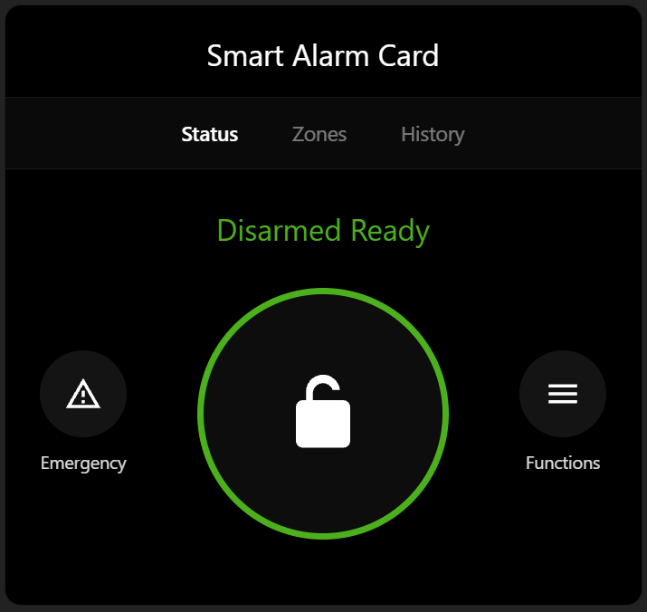

# Smart Alarm Card

A Home Assistant alarm card styled for a more modern looking security panel,
featuring a dark title bar, **Status / Zones / History** tabs, a large
Arm/Disarm ring button, Emergency function, Lock buttons, and an on-card
PIN keypad.



## Installation

### HACS (recommended)

1. In Home Assistant, go to **HACS → Frontend**.
2. Click the **⋮** menu (top right) → **Custom repositories**.
3. Add this repository URL, category **Lovelace**.
4. Find **Smart Alarm Card** in HACS and click **Download**.
5. Add the resource if it isn't added automatically:
   Settings → Dashboards → Resources → `/hacsfiles/smart-alarm-card/smart-alarm-card.js`, type **JavaScript Module**.

### Manual

1. Copy `smart-alarm-card.js` to `<config>/www/smart-alarm-card.js`.
2. Settings → Dashboards → Resources → Add Resource:
   URL `/local/smart-alarm-card.js`, type **JavaScript Module**.

## Usage

```yaml
type: custom:smart-alarm-card
entity: alarm_control_panel.home_alarm
name: Security System
require_code: true
code_length: 4
arm_modes:
  - away
  - home
zones:
  - entity: binary_sensor.front_door
    name: Front Door
  - entity: binary_sensor.back_door
    name: Back Door
lock:
  entity: lock.front_door
  name: Front Door Lock
```

## Options

| Name            | Type    | Default             | Description                                             |
|-----------------|---------|----------------------|-----------------------------------------------------------|
| `entity`        | string  | **required**         | `alarm_control_panel.*` entity                             |
| `name`          | string  | `Security System`    | Title bar text                                             |
| `require_code`  | boolean | `true`                | Show the on-card PIN keypad before arming/disarming        |
| `code_length`   | number  | `4`                   | Number of digits in the PIN                                 |
| `arm_modes`     | list    | `[away, home]`        | Arm modes offered: `away`, `home`, `night`, `vacation`, `custom_bypass` |
| `zones`         | list    | `[]`                  | List of `{ entity, name }` binary sensors shown on the Zones tab |
| `lock`          | object  | none                  | `{ entity, name }` door lock shown under Functions          |

## Notes

- History pulls the last 24 hours of logbook events for the alarm and zone entities.
- Emergency uses Home Assistant's generic `alarm_control_panel.alarm_trigger` service (HA doesn't distinguish police/fire/medical triggers).
